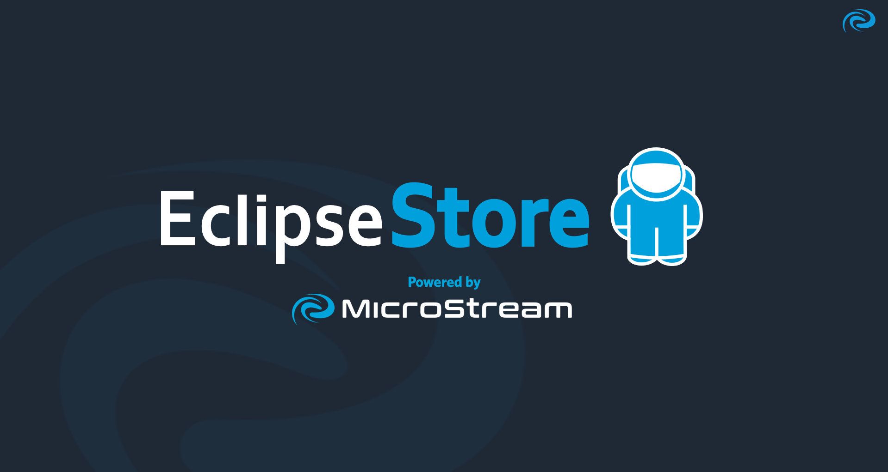

# Java Breaking News #269
## [Simplifying Dynamic Content in Spring Boot with JTE](https://foojay.io/today/spring-boot-java-template-engine-jte/)

  

The article introduces JTE, a new Java template engine specifically designed for Spring Boot applications. JTE offers high performance and a developer-friendly experience by allowing developers to craft dynamic content with ease. It emphasizes compile-time type safety, which helps catch errors early in the development process. The article provides an overview of JTE's features, installation steps, and code examples to demonstrate its capabilities. This engine aims to enhance productivity and maintainability in web application development.
<!-- Hash Tags -->
#Java #SpringBoot #JTE #TemplateEngine #WebDevelopment

---
## [EclipseStore: A New Era for Java Database Solutions](https://www.infoq.com/news/2024/11/java-database-eclipsestore/?utm_campaign=infoq_content&utm_source=infoq&utm_medium=feed&utm_term=Java)

  

The article announces the introduction of EclipseStore, a new Java database designed for modern application development. EclipseStore aims to offer efficient data handling with features such as transaction support, scalability, and seamless integration with existing Java frameworks. The database focuses on optimizing performance for cloud-native applications and enhances developer productivity through an intuitive API. Developers are encouraged to explore its capabilities and adapt it into their projects for improved data management solutions.
  
<!-- Hash Tags -->
#Java #EclipseStore #Database #CloudNative #DataManagement

---
## [What Comes After Open Source? Bruce Perens Has Some Ideas](https://thenewstack.io/what-comes-after-open-source-bruce-perens-has-some-ideas/)

  

In this article, [Bruce Perens](https://en.wikipedia.org/wiki/Bruce_Perens) explores the future of open source software, questioning its sustainability and evolution. He argues for the need to adapt open source principles to new realities, such as funding and community engagement. Perens suggests innovative models to support developers, including cooperative funding and enhanced governance structures. He also emphasizes the significance of inclusivity and collaboration in open source communities, advocating for strategies that can help keep projects alive and thriving in the ever-changing tech landscape.

<!-- Hash Tags -->
#OpenSource #BrucePerens #SoftwareDevelopment #Innovation #CommunityEngagement

---
## [Finding the Sweet Spot: Optimal Connection Pool Size Explained](https://vladmihalcea.com/optimal-connection-pool-size/)

  

The article explores the concept of optimal connection pool size in database management systems. It highlights the significance of configuring the right pool size to improve application performance and resource utilization. By examining various factors, such as system architecture, workload, and database characteristics, the author provides insights on how to determine the ideal connection pool size. The piece emphasizes the balance between too few connections, which can cause bottlenecks, and too many, which may result in resource contention.

<!-- Hash Tags -->
#connectionPooling #databaseManagement #performanceTuning #resourceOptimization #softwareDevelopment

---
## [Explicit Code Matters: Why You Might Say No to Lombok](https://www.danvega.dev/blog/no-lombok)

  

In this article, Dan Vega discusses the use of Lombok in Java development and presents arguments for why developers might consider avoiding it. While Lombok simplifies boilerplate code through annotations, Vega highlights potential downsides such as reducing code readability, hindering debugging, and introducing dependencies that may complicate projects. He advocates for clear, explicit code and explores alternative approaches to minimize boilerplate without compromising maintainability. The article encourages developers to weigh their choices carefully regarding Lombok's utility.

<!-- Hash Tags -->
#Java #Lombok #CodeQuality #SoftwareDevelopment #BestPractices

---
## [Ask the Java Architects](https://www.youtube.com/watch?v=SPc9YpLsYo8)

  

This video is a panel discussion with Java experts. The panelists discuss various topics related to Java, including the deprecation of the security manager, the tip and tail model, preview features, and the future of Java. They also discuss the importance of giving feedback on preview features and the challenges of project management.
